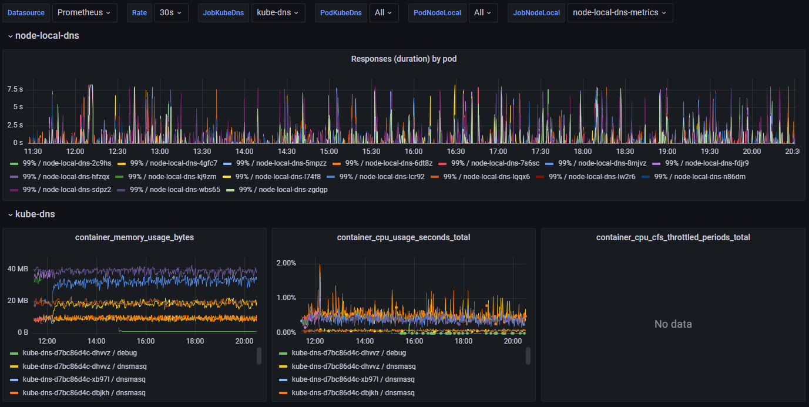
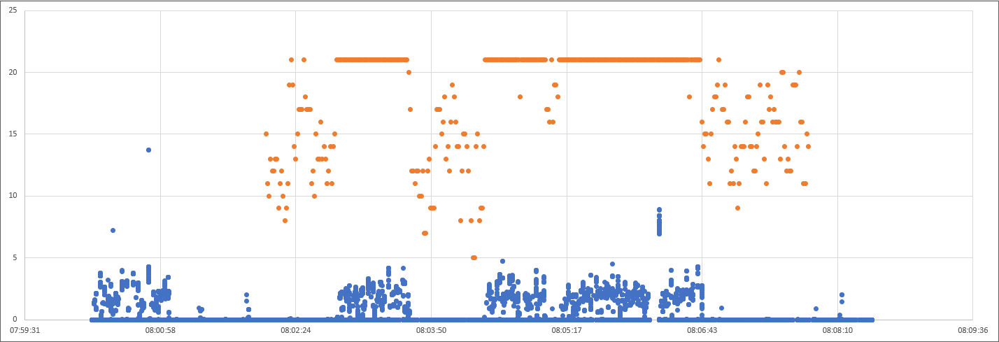
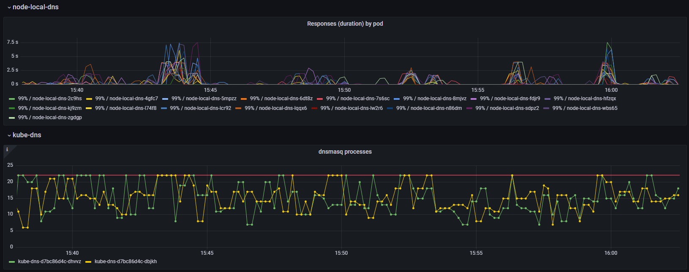
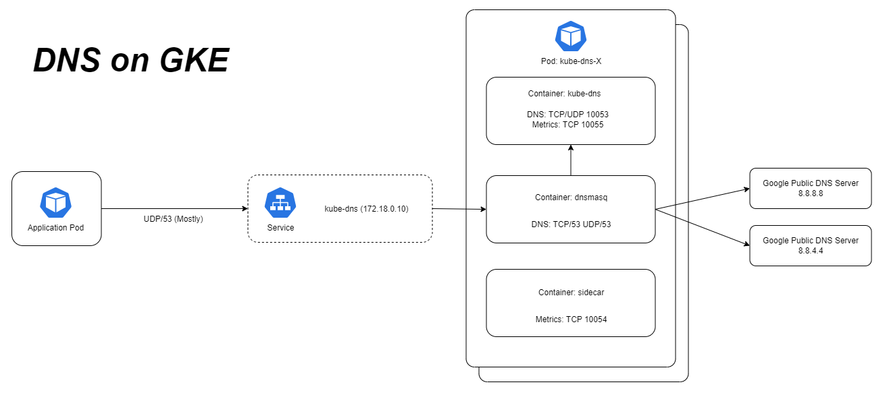
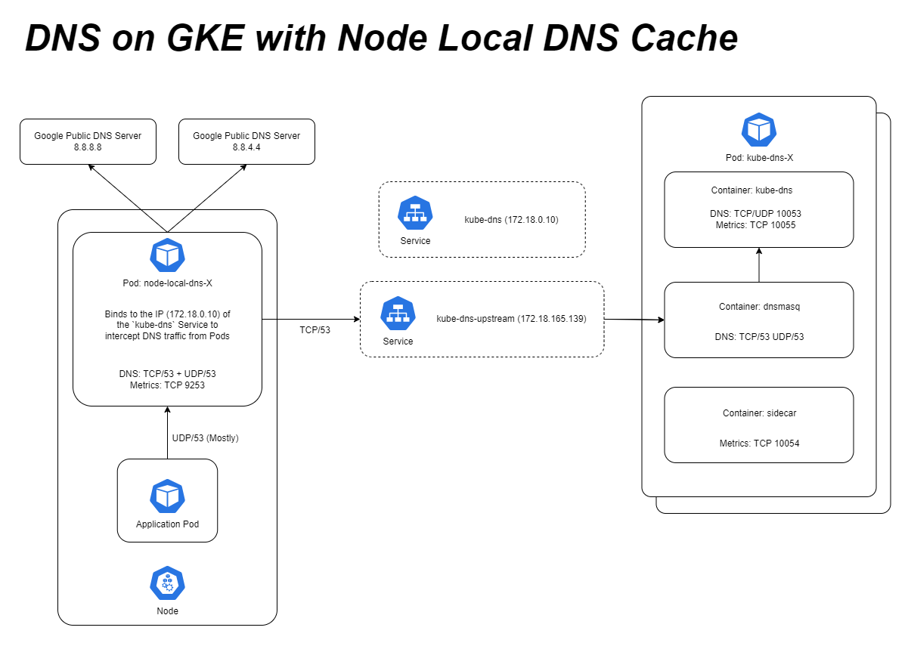
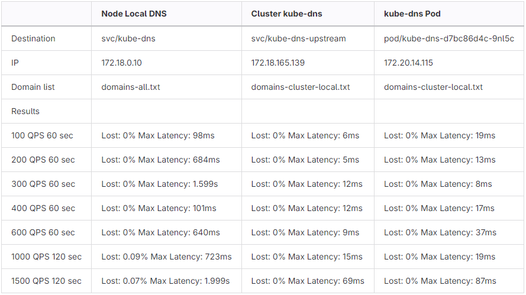
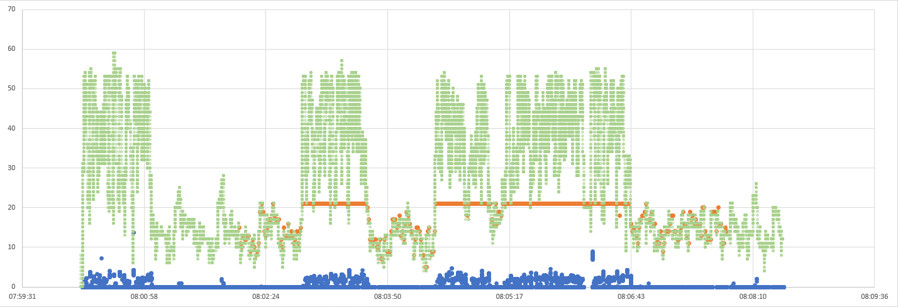
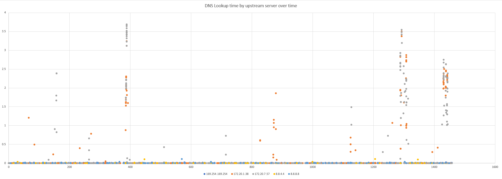
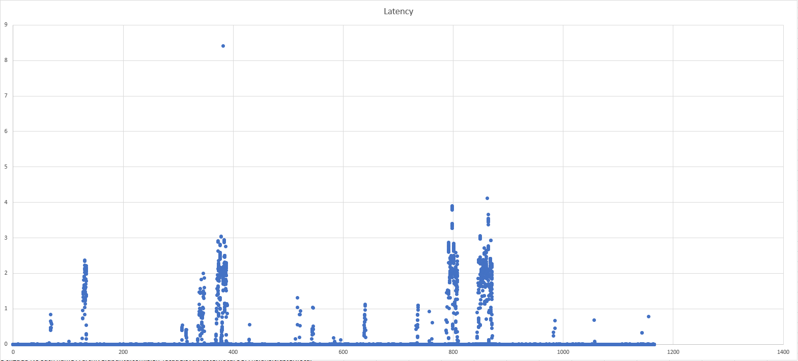
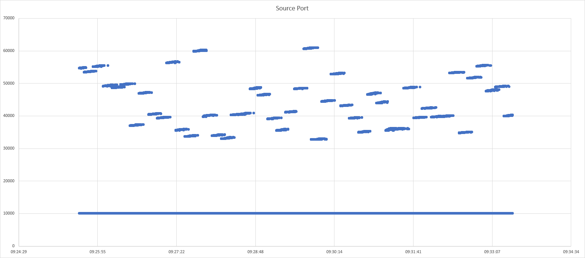

- [Introduction](#introduction)
- [TL;DR:](#tl-dr)
  - [NodeLocal DNSCache / CoreDNS](#nodelocal-dnscache-coredns)
  - [kube-dns / dnsmasq](#kubedns-dnsmasq)
  - [Am I affected?](#am-i-affected)
- [Investigation](#investigation)
  - [The initial Problem](#the-initial-problem)
  - [Istio / Envoy metrics](#istio-envoy-metrics)
  - [Reproducing and troubleshooting HTTP connection problems](#reproducing)
  - [Troubleshooting potentially slow or broken DNS lookups](#troubleshooting-dns)
- [Appendices](#appendices)
  - [Appendix - Enabling additional envoy metrics](#appendix-enabling-additional-envoy-metrics)
  - [Appendix - Overview of DNS on GKE](#appendix-overview-of-dns-on-gke)
  - [Appendix - Reducing DNS lookups in Kubernetes and GKE](#appendix-reducing-dns-lookups)
  - [Appendix - Overview of GKE DNS with NodeLocal DNSCache](#appendix-overview-of-gke-dns-with-nodelocal-dnscache)
  - [Appendix - Enabling node-local-dns metrics](#appendix-enabling-node-local-dns-metrics)
  - [Appendix - Using dnsperf to test DNS performance](#appendix-using-dnsperf)
  - [Appendix - Network packet capture without dependencies](#appendix-network-packet-capture)
  - [Appendix - Verbose logging on kube-dns](#appendix-verbose-logging-on-kube-dns)
  - [Appendix - Analyzing dnsmasq logs](#appendix-analyzing-dnsmasq-logs)
  - [Appendix - Analyzing concurrent TCP connections](#appendix-analyzing-concurrent-tcp-connections)
  - [Appendix - Analyzing DNS problems based on packet captures](#analyzing-dns-problems-based-on-packet-capture)
- [Footnotes](#footnotes)

*This is a cross-post of a blog post also published on the [Signicat Blog](https://www.signicat.com/blog/dont-use-nodelocal-dnscache-on-gke)*

<a id="introduction"></a>
# Introduction

Last year I was freelancing as a consultant in Signicat and recently I returned, now as an actual employee!

The first week after returning, a tech lead for another team reaches out to me about a technical issue he's been struggling with.

In this blog post I'll try to guide you through the troubleshooting with actionable take-aways. It appears it's going to be a long one with a lot of detours, so I've summarized our findings and recommendations here on the top starting right below this introduction. There are a few appendixes at the end that I've tried to make self-contained as to make them useful in other contexts and without necessarily having to follow the main story.

If you don't want any spoilers but follow the bumpy journey from start to end, fill your coffee mug and skip ahead to [Investigation](#investigation).

<a id="tl-dr"></a>
# TL;DR:

Due to an unfortunate combination of behaviour of [CoreDNS](https://coredns.io/manual/toc/) (which NodeLocal DNSCache uses) and [kube-dns](https://github.com/kubernetes/dns) (which is the default on GKE) **I recommend NOT using them in combination.**

Since [GKE does not offer CoreDNS as a managed option](https://cloud.google.com/knowledge/kb/how-to-run-coredns-on-kubernetes-engine-000004698) for `kube-dns` (even though [Kubernetes made CoreDNS the default in 1.13 in 2018](https://kubernetes.io/blog/2018/12/03/kubernetes-1-13-release-announcement/)) you are left with two options:
- Not enabling [NodeLocal DNSCache on GKE](https://cloud.google.com/kubernetes-engine/docs/how-to/nodelocal-dns-cache)
- Switching from `kube-dns` [to Google Cloud DNS](https://cloud.google.com/kubernetes-engine/docs/how-to/cloud-dns)

*What is this unfortunate combination you ask?*

<a id="nodelocal-dnscache-coredns"></a>
## NodeLocal DNSCache / CoreDNS

NodeLocal DNSCache (in GKE at least) is configured with:

    # kubectl get configmap --namespace kube-system node-local-dns -o yaml | yq .data.Corefile
    cluster.local:53 {
      forward . __PILLAR__CLUSTER__DNS__ {
          force_tcp
          expire 1s

This means CoreDNS will upgrade any and all incoming DNS requests to TCP connections before connecting to `dnsmasq` (the first of two containers in a `kube-dns` Pod). CoreDNS reuses TCP connections if available. Unused connections in the connection pool should be cleaned up every 1 second (in theory). If no connections are available a new will be created, apparently with no upper bound.

This means new connections may be created en-masse when needed, but old connections can take a while (I've observed 5-10 seconds) before being cleaned up, and most importantly, closed.

<a id="kubedns-dnsmasq"></a>
## kube-dns / dnsmasq

`dnsmasq` has a [hardcoded maximum number of 20 workers](https://github.com/imp/dnsmasq/blob/master/src/config.h#L18). For us that means each `kube-dns` Pod is limited to 20 open connections.

`kube-dns` scaling is managed by a bespoke kube-dns autoscaler that by default in GKE is [configured](https://cloud.google.com/kubernetes-engine/docs/how-to/nodelocal-dns-cache#scaling_up_kube-dns) like:

    # kubectl get configmap --namespace kube-system kube-dns-autoscaler -o yaml | yq .data.linear
    {"coresPerReplica":256, "nodesPerReplica":16,"preventSinglePointFailure":true}

- `preventSinglePointFailure` - Run at least two Pods.
- `nodesPerReplica` - Run one `kube-dns` Pod for each 16 nodes.

This default setup will have two `kube-dns` Pods until your cluster grows beyond 32 nodes.

Two `kube-dns` Pods have a limit of 40 open TCP connections in total from the `node-local-dns` Pods running on each node. The `node-local-dns` Pods though are happy to try to open many more TCP connections.

GKE kube-dns docs mention "[Performance limitations with kube-dns](https://cloud.google.com/kubernetes-engine/docs/how-to/kube-dns#performance_limitations_with_kube-dns)" as a known issue suggesting enabling NodeLocal DNSCache as a potential fix.

And GKE NodeLocal DNSCache docs mention "[NodeLocal DNSCache timeout errors](https://cloud.google.com/kubernetes-engine/docs/how-to/nodelocal-dns-cache#timeout_issues)" as a known issue with the possible reasons being
- An underlying network connectivity problem. (*Spoiler: it probably isn't*)
- Significantly increased DNS queries from the workload or due to node pool upscaling. (*Spoiler: it probably isn't*)

With the fix being

> **"The workaround is to increase the number of kube-dns replicas by tuning the autoscaling parameters."**

Increasing the number of `kube-dns` Pods will reduce the frequency and impact but not eliminate it. Until we migrate to Cloud DNS we run `kube-dns` at a ratio of 1:1.5 of nodes by configuring autoscaling with `"coresPerReplica":24` and using 16 core nodes. Resulting in 12 `kube-dns` Pods in a 17 node cluster.

> By looking at the `coredns_forward_conn_cache_misses_total` metric I observe it at least increasing by more than 300 in a 15 second metric sampling window for _one_ `node-local-dns` Pod. This means _on average_ during those 15 seconds 20 new TCP connections were attempted since no existing connection could be re-used. ([Footnote A](#footnote-a))
>
> This means even setting `"nodesPerReplica":1` thus running one `kube-dns` Pod for each node may not be enough to guarantee not hitting the 20 process limit in `dnsmasq` occasionally.
>
> I guess you could start lowering `coresPerReplica` to have more than one `kube-dns` Pod for each node, but now it's getting silly.

To re-iterate; If you're using NodeLocal DNSCache and `kube-dns` you should plan to migrate to Cloud DNS. You can alleviate the problem in the short term by scaling up `kube-dns` aggressively but it will not eliminate occasional latency spikes.

<a id="am-i-affected"></a>
## Am I affected?

How do I know if I'm affected by this?

- You are using NodeLocal DNSCache (CoreDNS) and `kube-dns` (default on GKE)
- You see log lines with `i/o timeout` in node-local-dns pods (`kubectl logs -n kube-system node-local-dns-xxxxx`)
- You are hitting dnsmasq max procs. Create a graph `container_processes{namespace="kube-system", container="dnsmasq"}` or use my [kube-dns Grafana dashboard](https://github.com/signicat/blog-attachements/blob/main/2023-gke-node-local-dns-cache/files/grafana-dashboard-kube-dns.json). ([Footnote B](#footnote-b)).

<a id="investigation"></a>
# Investigation

<a id="the-initial-problem"></a>
## The initial Problem

We have a microservice architecture and use [Open Policy Agent (OPA)](https://www.openpolicyagent.org/) deployed as [sidecars](https://kubernetes.io/blog/2015/06/the-distributed-system-toolkit-patterns/#example-1-sidecar-containers) to process and validate request tokens.

However, some services were getting timeouts and he suspected it was an issue with [istio](https://istio.io/), a service mesh that provides security and observability for traffic inside Kubernetes clusters.

The actual error message showing up in the logs was a generic `context deadline exceeded (Client.Timeout exceeded while awaiting headers)` which I recognize as a Golang error probably stemming from a [http.Get()](https://pkg.go.dev/net/http) call or similar.

The first thing that comes to mind is that last year we made a change in our istio practices. Inside our clusters we call services in other namespaces (crossing team boundaries) using the same FQDN domain and path that our customers would use, not internal Kubernetes names. So internally we're calling `api.signicat.com/service` and not `service.some-team-namespace`.

He had noticed that the problem seemed to have increased when doing the switch from internal DNS names to FQDN.

<a id="istio-envoy-metrics"></a>
## Istio / Envoy metrics

We started troubleshooting by enabling additional metrics in envoy to hopefully be able to confirm that the problem was visible as envoy timeouts or some other kind of error.

> [Envoy](https://www.envoyproxy.io/) is the actual software that traffic goes through in an istio service mesh.

This turned out to be a dead end and we couldn’t find any signs of timeouts or errors in the envoy metrics.

> *Enabling these additional metrics was a bit of a chore and there were a few surprises. Have a look at the [Enabling additional envoy metrics](#appendix-enabling-additional-envoy-metrics) appendix for steps and caveats.*

<a id="reproducing"></a>
## Reproducing and troubleshooting HTTP connection problems

At this point I'm thinking the problem may be something else. Failure to acquire a HTTP connection from the pool or a TCP socket maybe?

Using the [httptrace](https://pkg.go.dev/net/http/httptrace) golang library I created a small program that would continuously query both the internal `some-service.some-namespace` hostname and FQDN `api.signicat.com/some-service`, while logging and counting each phase of the HTTP request as well as it's timings.

Here is a quick and dirty way of starting the program in an ephemeral Pod:
      
    # Start a Pod named `conn-test` using the `golang:latest` image. Attach to it (`-i --tty`) and start `bash`. Delete it after disconnecting (`--rm`):
    kubectl run conn-test --rm -i --tty --image=golang:latest -- bash
    # Create and enter a directory for the program:
    mkdir conn-test && cd conn-test
    # Initialize a go environment for it:
    go mod init conn-test
    # Download the source:
    wget https://raw.githubusercontent.com/signicat/blog-attachements/main/2023-gke-node-local-dns-cache/files/go-http-connection-test/main.go
    # Download dependencies:
    go mod tidy
    # Configure it (refer to the source for more configuration options):
    export URL_1=http://some-service.some-namespace.svc.cluster.local
    # Start it:
    go run main.go

> If you need to run it for longer it probably makes sense to build it as a Docker image, upload it to an image registry and create a Deployment for it. It also exposes metrics in Prometheus format so you can also add scraping of the metrics either through annotations or a ServiceMonitor.

After a few hours the program crashed, and the last log message indicated that `DNSStart` was the last thing to happened. (The program crashed since I just `log.Fatal`ed if the request failed, which it did timing out. I since improved that, even though we already learned what we needed).

We did some manual DNS lookups using `nslookup -debug api.signicat.com` which (obviously, in retrospect) shows 6 failing DNS requests before finally getting it right:

 - `api.signicat.com.$namespace.svc.cluster.local - NXDOMAIN`
 - `api.signicat.com.svc.cluster.local - NXDOMAIN`
 - `api.signicat.com.cluster.local - NXDOMAIN`
 - `api.signicat.com.$gcp-region.c.$gcp-project.internal - NXDOMAIN`
 - `api.signicat.com.c.$gcp-project.internal - NXDOMAIN`
 - `api.signicat.com.google.internal - NXDOMAIN`
 - `api.signicat.com - OK`


*See [Overview of DNS on GKE](#appendix-overview-of-dns-on-gke) for a lengthier explanation of why this happens.*

The default timeout for HTTP requests in Golang is 5 seconds. DNS resolution *should* be fast enough and it shouldn't be a problem to do 7 DNS lookups in that time. But if there is some sluggishness and variability in DNS resolution times the probability of having one slow lookup out of the 7 being slow increases the risk of causing a timeout. In addition, always doing 7 lookups puts additional strain on the DNS infrastructure potentially further exacerbating the probability of slow lookups.

From here on we have two courses of action. Figure out if we can reduce the number of DNS lookups as well as figure out if, and why, DNS resolution isn't consistently fast.

*See [Reducing DNS lookups in Kubernetes and GKE](#appendix-reducing-dns-lookups) for some thoughts on reducing these extraneous DNS lookups.*

<a id="troubleshooting-dns"></a>
## Troubleshooting potentially slow or broken DNS lookups

We use [NodeLocal DNSCache](https://kubernetes.io/docs/tasks/administer-cluster/nodelocaldns/) which on GKE is [enabled by clicking the right button](https://cloud.google.com/kubernetes-engine/docs/how-to/nodelocal-dns-cache).

> **NodeLocal DNSCache summary**
> 
> It is deployed by a ReplicaSet causing one CoreDNS Pod (named `node-local-dns-x` in `kube-system` namespace) to be running on each node.
> 
> It adds a listener on the same IP as the `kube-dns` Service. Thereby intercepting traffic that would otherwise go to that IP.
> 
> The `node-local-dns` Pod caches both positive and negative results. Domains ending in `.cluster.local` are forwarded to `kube-dns` in the cluster (but through a new Service called `kube-dns-upstream` with a different IP). Requests for other domains are forwarded to 8.8.8.8 and 8.8.4.4.
> 
> NodeLocal DNSCache instances use a 2 second timeout when querying upstream DNS servers.
> 
> *See [Overview of GKE DNS with NodeLocal DNSCache](#appendix-overview-of-gke-dns-with-nodelocal-dnscache) for additional details.*


We wanted to look at some metrics from the `node-local-dns` Pods but found that we didn't have any! We fixed that but didn't at the time learn anything new. *See [Enabling node-local-dns metrics](#appendix-enabling-node-local-dns-metrics) for how to fix/enable node-local-dns metrics.*

Stumbling over the logs of one of the `node-local-dns-x` Pods I notice:

    [ERROR] plugin/errors: 2 archive.ubuntu.com.some-namespace.svc.cluster.local. A: dial tcp 172.18.165.130:53: i/o timeout

This tells us that at least lookups going to `kube-dns` in the cluster (`172.18.165.130:53`) are having problems.

So timeouts are happening on individual lookups, it's not just the total duration of 7 lookups timing out. And lookups are not only happening inside the client application but in `node-local-dns` as well. We still don't know if these lookups are lost or merely slow. But seen from the application anything longer than 2 seconds, that is timing out on `node-local-dns`, might as well be lost.

Just to be sure I checked that packets were not being dropped or lost on the nodes on both sides. And indeed the network seems fine. It's been a long time since I've actually experienced problems due to packets being lost, but it's always good to rule it out.

Next step is to capture the packets as they (hopefully) leave the `node-local-dns` Pod and (maybe) arriving at one of the `kube-dns` Pods.

*See [Network packet capture without dependencies](#appendix-network-packet-capture) for how to capture packets in Kubernetes.*

The packets are indeed arriving at the `dnsmasq` container in the `kube-dns` Pods:

    Query 0x31e8:

    Leaves node-local-dns eth0:
    10:53:11.134	10.0.0.107	172.20.13.4	DNS	0x31e8	Standard query 0x31e8 A archive.ubuntu.com.some-ns.svc.cluster.local

    Arrives at dnsmasq eth0:
    10:53:11.134	10.0.0.107	172.20.13.4	DNS	0x31e8	Standard query 0x31e8 A archive.ubuntu.com.some-ns.svc.cluster.local

Looking at DNS resolution time from the `kube-dns` container which `dnsmasq` forwards to shows that `kube-dns` is consistently answering queries extremely fast (not shown here).

But after some head scratching I look at the time between queries arriving at `dnsmasq` on `eth0` before leaving again on `lo` for `kube-dns` and indeed there is a (relatively) long delay of 952ms between 10:53:11.134 and 10:53:12.086:

    Leaves dnsmasq lo:
    10:53:12.086	127.0.0.1	127.0.0.1	DNS	0x31e8	Standard query 0x31e8 A archive.ubuntu.com.some-ns.svc.cluster.local

In this case the query just sits around in `dnsmasq` for almost one second before being forwarded to `kube-dns`!

Why? As with most issues we start by checking if there are any issues with memory or CPU usage or CPU throttling ([Footnote C](#footnote-c)).



Nope. CPU and memory usage is both low and stable but the 99 percentile DNS request duration is all over the place.

We also check and see that there is plenty of unused CPU available on the underlying nodes these pods are running on.

> We also used `dnsperf` to benchmark and stress-test the various components and while fun, didn't teach us anything new. *See [Using dnsperf to test DNS performance](#appendix-using-dnsperf) for more information on that particular side-quest.*

Next up I want to increase the logging verbosity of `dnsmasq` to see if there are any clues to why it was (apparently) delaying processing DNS requests.

*Have a look at [Verbose logging on kube-dns](#appendix-verbose-logging-on-kube-dns) for how to increase logging and [Analyzing dnsmasq logs](#appendix-analyzing-dnsmasq-logs) for how I analyzed the logs.*

Analyzing the logs we learn that at least it appears that individual requests are fast and not clogging up the machinery.

In the meantime Google Cloud Support came back to us asking if we could run a command `for i in $(seq 1 1800) ; do echo "$(date) Try: ${i} DnsmasqProcess: $(pidof dnsmasq | wc -w)"; sleep 1; done` on the VM of the Pod. It also works to run this in a debug container attached to the `dnsmasq` container. The output looks like:

    Wed Oct 11 14:50:57 UTC 2023 Try: 1 DnsmasqProcess: 9
    Wed Oct 11 14:50:58 UTC 2023 Try: 2 DnsmasqProcess: 14
    Wed Oct 11 14:50:59 UTC 2023 Try: 3 DnsmasqProcess: 15
    Wed Oct 11 14:51:00 UTC 2023 Try: 4 DnsmasqProcess: 21
    Wed Oct 11 14:51:01 UTC 2023 Try: 5 DnsmasqProcess: 21

It turns out that `dnsmasq` has a [hard coded limit of 20 child processes](https://github.com/imp/dnsmasq/blob/master/src/config.h#L18). So every time we see 21 it means it will not spawn a new child to process incoming connections.

I plotted this on the same graph as the DNS request times observed from raw packet captures (See [Analyzing DNS problems based on packet captures](#analyzing-dns-problems-based-on-packet-capture)):



Graphing the number of `dnsmasq` processes and observed DNS request latency finally shows a stable correlation between our symptoms and a potential cause.

You can also get a crude estimation by graphing the `container_processes{namespace="kube-system", container="dnsmasq"}` metric, or use my [kube-dns Grafana dashboard](https://github.com/signicat/blog-attachements/blob/main/2023-gke-node-local-dns-cache/files/grafana-dashboard-kube-dns.json) if you have cAdvisor/container metrics enabled:



Going back to our packet captures I see connections that are unused for many seconds before finally being closed by `node-local-dns`.

    08:06:07.849	172.20.9.11	10.0.0.29	53 → 46123 [ACK] Seq=1 Ack=80 Win=43648 Len=0
    08:06:09.849	10.0.0.29	172.20.9.11	46123 → 53 [FIN, ACK] Seq=80 Ack=1 Win=42624 Len=0
    08:06:09.890	172.20.9.11	10.0.0.29	53 → 46123 [ACK] Seq=1 Ack=81 Win=43648 Len=0

However `dnsmasq` only acknowledges the request to close the connection, it does not actually close it yet. In order for the connection to be properly closed both sides have to `FIN, ACK`.

Many seconds later `dnsmasq` faithfully tries to return a response and finish the closing of the connection, but `node-local-dns` (CoreDNS) has promptly forgotten about the whole thing and replies with the TCP equivalent of a shrug (`RST`):

    08:06:15.836	172.20.9.11	10.0.0.29	53	46123	Standard query response 0x7f12 No such name A storage.googleapis.com.some-ns.svc.cluster.local SOA ns.dns.cluster.local
    08:06:15.836	172.20.9.11	10.0.0.29	53	46123	53 → 46123 [FIN, ACK] Seq=162 Ack=81 Win=43648 Len=0
    08:06:15.836	10.0.0.29	172.20.9.11	46123	53	46123 → 53 [RST] Seq=81 Win=0 Len=0

Then I analyzed the whole packet capture to find the number of open connections at any time as well as the frequency and duration of these lingering TCP connections. *See [Analyzing concurrent TCP connections](#appendix-analyzing-concurrent-tcp-connections) for details on how.*

What we find is that the number of open connections at times surge way past 20 and that coincides with increased latency. In addition unused connections stay open for a problematic long time (5-10 seconds).

Since the closing of connections is initiated by CoreDNS. Is there any way we can make CoreDNS close connections faster or limit the number of connections it uses?

NodeLocal DNSCache (in GKE at least) is configured (`kubectl get configmap --namespace kube-system node-local-dns -o yaml | yq .data.Corefile`) with:

    cluster.local:53 {
      forward . __PILLAR__CLUSTER__DNS__ {
          force_tcp
          expire 1s

So it is actually configured to "expire" connections after 1 second.

I'm not well versed in the CoreDNS codebase but it seems expiring connections is [handled by a ticker](https://github.com/coredns/coredns/blob/master/plugin/pkg/proxy/persistent.go#L48). A ticker in go sends a signal every "tick" that can be used to trigger events for example. This means connections aren't closed once they pass the 1 second mark, but the cleanup process runs every 1 second and then purges expired connections. So a connection can be idle for almost 2x the time (2 seconds in our case) before being cleaned up.

I still can't explain why we see connections lingering on for 5-10 seconds though.

There are no configuration options indicating that it's possible to limit the number of connections. Nor anything in the code that would suggest it's a possibility. Adding it is probably not done in a day either as it would require making decisions on trade-offs about how to handle excess traffic volume. How much to queue, for how long. How to avoid the queue eating too much memory. What to do when the queue is full and so on and so on.

At this point I feel we have a pretty good grasp of how all of this conspires to cause the problems we observe. But unfortunately I can't see any permanent solution that does not require modifying CoreDNS and ideally `dnsmasq` code itself. At the moment we don't have the capacity to create and push through such changes upstream. If I could snap my fingers and magically get some new features they would be:

- dnsmasq
  - Make `MAX_PROCS` configurable.

- CoreDNS
  - Configurable max TCP connection pool size. Metrics on pool size and usage.
  - Configurable queue size for requests waiting for a new connection from the pool. Metrics on queue capacity (max) and current size for tuning.

But until that becomes a reality I think the best option is to avoid using NodeLocal DNSCache in combination with `kube-dns`, and instead replace `kube-dns` with Cloud DNS.

<a id="appendices"></a>
# Appendices

<a id="appendix-enabling-additional-envoy-metrics"></a>
## Appendix - Enabling additional envoy metrics

*See [istio.io](https://istio.io/latest/docs/concepts/observability/#proxy-level-metrics) for some high level info on proxy-level metrics and [envoyproxy.io](https://www.envoyproxy.io/docs/envoy/latest/configuration/upstream/cluster_manager/cluster_stats) for complete list of available metrics.*

Most likely we are interested in the `upstream_cx_*` and `upstream_rq_*` metrics.

By default metrics are only gathered and exposed for the `xds-grpc` cluster, and the full stats name looks like `cluster.xds-grpc.upstream_cx_total`. The `xds-grpc` cluster I assume is metrics for traffic between the `istio-proxy` containers in each Pod and the central istio services (`istiod`) used for configuration management.

> A cluster in envoy is a grouping of backends and endpoints. Typically each Kubernetes `Service` will be it’s own cluster. There are also separate clusters named `BlackHoleCluster`, `InboundPassthroughClusterIpv4` and `PassthroughCluster`.

When enabling metrics for other services (or clusters as they're also called) they look like

- `cluster.outbound|80||my-service.my-namespace.svc.cluster.local.upstream_cx_total` for outgoing traffic and
- `cluster.inbound|8080||.upstream_cx_total` for incoming traffic.

> Beware that traffic to for example api.signicat.com/some-service will be mapped to the internal Kubernetes Service DNS name in the metric, like some-service.some-team.svc.cluster.local.
> 
> Ports are also mapped. For outgoing traffic it will be the port in the Service. While for incoming traffic it will be the port the Pod is actually listening on, and not the one mapped in the Service.

### Enabling additional envoy metrics

istio.io documents [how to enable additional envoy metrics](https://istio.io/latest/docs/ops/configuration/telemetry/envoy-stats/) both globally in the mesh by configuring the `IstioOperator` object as well as on a per Deployment/Pod using the `proxy.istio.io/config` annotation.

> **WARNING: Be very careful when enabling additional metrics as they have a tendency to expose orders of magnitude more time-series than you might expect.**
> 
> I apparently managed to get Prometheus OOMKilled even with my fairly limited testing on two deployments.
> 
> If you happen to have [VictoriaMetrics](https://victoriametrics.com/) in your monitoring stack you can monitor cardinality (the number of unique time-series, which is the thing that usually breaks a time-series database) in the VM UI:
> ```
> kubectl -n metrics port-forward services/victoria-metrics-cluster-vmselect 8481:8481
> ```
> And going to http://localhost:8481/select/0/vmui/?#/cardinality

### Enable additional metrics on a Deployment or Pod

To enable additional metrics on a Deployment or Pod, add the following annotations:

```yaml
metadata:
  annotations:
    proxy.istio.io/config: |-
      proxyStatsMatcher:
        inclusionSuffixes:
          - "upstream_rq_timeout"
          - "upstream_rq_retry"
          - "upstream_rq_retry_limit_exceeded"
          - "upstream_rq_retry_success"
          - "upstream_rq_retry_overflow"
```

Remember to add this to the **Pod** metadata (`spec.template.metadata`) if adding to a Deployment.

> This results in a new time-series being exposed for each Service and Port (Cluster) that envoy has configured.
> 
> In our case we have ~500 services in our dev cluster and enabling these specific metrics adds ~3.800 new time-series for _each Pod_ in the Deployment we added it to. The test Deployment I'm playing with has 6 Pods so ~23.000 new time-series from adding 5 additional metrics to 1 Deployment!

Another option is to use regex to enable additional metrics:

```yaml
          inclusionRegexps:
          - ".*upstream_rq_.*"
          - ".*upstream_cx_.*"
```

But again, enabling these ~50 metrics on this specific Deployment will result in ~250.000 new time-series.

> Be especially wary of metrics envoy exposes as histograms, such as `upstream_cx_connect_ms` and `upstream_cx_length_ms` as they result in many _bucket time-series. During my testing this resulted in 6-7 million new time-series in total.

It's possible to specify only the connections we are interested in, which makes it manageable, cardinality wise. For example to only gather metrics from Services A through F in their corresponding namespaces:

```yaml
    inclusionRegexps:
      - ".*(svc-a.ns-a.svc|svc-b.ns-b.svc|svc-c.ns-c.svc|svc-d.ns-d.svc|svc-e.ns-e.svc|svc-f.ns-f.svc).*.upstream_rq.*"
      - ".*(svc-a.ns-a.svc|svc-b.ns-b.svc|svc-c.ns-c.svc|svc-d.ns-d.svc|svc-e.ns-e.svc|svc-f.ns-f.svc).*.upstream_cx.*"
```

### Enable additional metrics globally (please don’t!)

You can also enable additional metrics globally across the mesh. But that's probably a very bad idea if you are running at any sort of scale. I estimated that enabling `.*upstream_rq_.*` and `.*upstream_cx_.*` in our dev cluster would result in 50M additional time-series at a minimum. Or 5-10x our current Prometheus usage.

If you are using the old [Istio Operator](https://istio.io/latest/docs/setup/install/operator/) way of installing and managing istio it should be enough to update the `IstioOperator` object in the cluster. If you are using `istioctl` ([recommended](https://istio.io/latest/about/faq/#install-method-selection)) you must update the source `IstioOperator` manifest that is being fed to `istioctl` and run the appropriate `istioctl` commands again to update. Note that this also creates an `IstioOperator` object in the cluster with whatever config is used. But in this case it's never used for anything other than reference. So updating the `IstioOperator` object in a cluster if managing istio with `istioctl` does nothing.

### Viewing stats and metrics

Metrics should start becoming available in Prometheus with names like `envoy_cluster_upstream_cx_total`. Note that by default you'll already see metrics from the `xds-grpc` cluster.

You can also get the [stats directly from a sidecar](https://istio.io/latest/docs/ops/configuration/telemetry/envoy-stats/). Either by querying the `pilot-agent` directly:
      
    kubectl exec -n my-namespace my-pod -c istio-proxy -- pilot-agent request GET stats

Or querying the metrics endpoint exposed to Prometheus:

    kubectl exec -n my-namespace my-pod -c istio-proxy -- curl -sS 'localhost:15000/stats/prometheus'

Note that these will not give you any additional metrics compared to those exposed to Prometheus. A metric that is not enabled will not show up, and all metrics that are enabled are also automatically exposed to Prometheus.

### Notes on timeout and retry metrics

If istio is configured to be involved with timeouts and retries that is configured on the [VirtualService](https://istio.io/latest/docs/reference/config/networking/virtual-service/#Destination) level.

That means it will only take effect if using `api.signicat.com/some-service` (a route in a Istio `VirtualService`) and not `some-service.some-namespace.svc.cluster.local` (Kubernetes `Service`).

Istio will only count timeouts and retries for requests to a `VirtualService` route that has timeouts (and optionally retries) configured.

Additionally, the timeouts and retries seems to be enforced, and counted, in the Source istio-proxy (envoy), and not the Target.

### Further work

It would be beneficial to be able to have envoy only show/export metrics that are non-zero. Since there is usually only a very small set of all possible Service-to-Service pairs that will actually regularly have traffic.

It’s possible to customize metrics using the Telemetry API ([Customizing Istio Metrics with Telemetry API](https://istio.io/latest/docs/tasks/observability/metrics/telemetry-api/)) but it seems limited to only working with metrics and their dimensions. Not the time-series values.

[WASM plugins](https://istio.io/latest/docs/reference/config/proxy_extensions/wasm-plugin/) are probably not a good fit either and are experimental and causes a severe CPU and memory penalty.

> **Edit to add in 2024**
>
> We know today that the reason for so many time-series (reporting zero), as well as elevated memory usage in `istio-proxy`, is because we did not filter exposed Services between namespaces causing every `istio-proxy` to keep track of every pair of possible workloads in the whole cluster.

<a id="appendix-overview-of-dns-on-gke"></a>
## Appendix - Overview of DNS on GKE

> **kube-dns and CoreDNS confusion**
>
> The main difference between DNS on upstream Kubernetes and GKE is that Kubernetes [switched to](https://kubernetes.io/blog/2018/07/10/coredns-ga-for-kubernetes-cluster-dns/) CoreDNS 5 years ago while GKE [still uses](https://cloud.google.com/kubernetes-engine/docs/how-to/kube-dns) the old `kube-dns`. It’s [possible to add CoreDNS but it’s not possible to remove or disable](https://cloud.google.com/knowledge/kb/how-to-run-coredns-on-kubernetes-engine-000004698) `kube-dns`.
>
> In upstream K8s, [CoreDNS reached GA back in 2018 in K8s 1.11](https://kubernetes.io/blog/2018/07/10/coredns-ga-for-kubernetes-cluster-dns/) and `kube-dns` was [removed from kubeadm in K8s 1.21](https://kubernetes.io/docs/tasks/administer-cluster/coredns/#migrating-to-coredns).
>
> However for [backwards compatibility](https://github.com/coredns/deployment/issues/116) CoreDNS [still uses](https://github.com/coredns/deployment/blob/master/kubernetes/coredns.yaml.sed) the name `kube-dns`, which makes things confusing for sure!



Part of the magic of Kubernetes is it's DNS-based Service Discovery. Lets say we deploy an application that has a `Service` named `helloworld` to the namespace `team-a`. Other applications in the same namespace are able to connect to that service by calling for example `http://helloworld`. This makes it easy to build and configure a group of microservices that talk to each other without needing to know about namespaces or FQDNs. Applications in another namespace can also call that application using `http://helloworld.team-a`. ([Footnote D](#footnote-d)).

This magic is achieved using the standard DNS `search` domain list feature. On Linux the `/etc/resolv.conf` [file](https://man7.org/linux/man-pages/man5/resolv.conf.5.html) defines which DNS servers to use. It also includes a `search` option that works together with the `ndots` option. You can see this by executing `cat /etc/resolv.conf` in any `Pod`.

If a domain name contains fewer "dots" (".") than `ndots` is set to, the DNS resolver will first try the hostname with each of the appended domains in `search`. In Kubernetes (and GKE) ndots is by default set to 5.

In vanilla Kubernetes the search domains are` <namespace>.svc.cluster.local svc.cluster.local cluster.local` while on GKE it's `<namespace>.svc.cluster.local svc.cluster.local cluster.local <gcp-zone>.c.technology-dev-platform.internal c.<gcp-project>.internal google.internal`.

This means if we call `https://api.signicat.com` (2 dots) it will first try to resolve `api.signicat.com.some-namespace.svc.cluster.local` and so on through the whole list, sequentally, before finally trying `api.signicat.com` and actually succeeding.

*See [Reducing DNS lookups in Kubernetes and GKE](#appendix-reducing-dns-lookups) for thoughts on avoiding some of this.*

Then the requests are sent to the `dnsmasq` container of a `kube-dns` Pod. `dnsmasq` is configured by a combination of command-line arguments defined in the `kube-dns` Deployment and data from the `kube-dns` [ConfigMap](https://cloud.google.com/kubernetes-engine/docs/how-to/kube-dns). We have not changed the default `kube-dns` ConfigMap and this results in `dnsmasq` running with these arguments:

    /usr/sbin/dnsmasq -k \
        --cache-size=1000 \
        --no-negcache \
        --dns-forward-max=1500 \
        --log-facility=- \
        --server=/cluster.local/127.0.0.1#10053 \
        --server=/in-addr.arpa/127.0.0.1#10053 \
        --server=/ip6.arpa/127.0.0.1#10053 \
        --max-ttl=30 \
        --max-cache-ttl=30 \
        --server /internal/169.254.169.254 \
        --server 8.8.8.8 \
        --server 8.8.4.4 \
        --no-resolv

This means all lookups for `cluster.local`, `in-addr.arpa` and `ip6.arpa` will be sent to `127.0.0.1:10053`, which is the `kube-dns` container. Lookups for `internal` are sent to `169.254.169.254`. All others are sent to `8.8.8.8` and `8.8.4.4`.

In addition `--no-negcache` disables caching for lookups that were not found (`NXDOMAIN`). This is particularly interesting since that means when looking up for example `api.signicat.com` and the domains in the `search` list are first tried, they will all result in `NXDOMAIN` but `dnsmasq` will not cache those results but send them on to `kube-dns`. *Every*. *Time*. This may severely reduce the usefulness of the cache and create a constant volume of traffic to `kube-dns` itself.

> It's also worth noting that Google Public DNS servers have a [default rate limit of 1500 QPS per IP](https://developers.google.com/speed/public-dns/docs/isp).

<a id="appendix-reducing-dns-lookups"></a>
## Appendix - Reducing DNS lookups in Kubernetes and GKE

There are two reasons for the 7 DNS lookups instead of the ideal 1. First is the `ndots` which tells the DNS resolver in the container if a domain name has fewer dots than this, it will first try looking up the name by appending each entry in the `search` list sequentially. For Kubernetes `ndots` is set to 5 (why is [explained by Tim Hockin here](https://github.com/kubernetes/kubernetes/issues/33554#issuecomment-266251056)). So `api.signicat.com` only has 2 dots, and hence will first go through the list of search domains.

Secondly GKE adds 3 extra search domains in addition to the 3 standard ones in Kubernetes. Bringing the total to 6 before doing the "proper" DNS lookup.

The specific assumption we are deviating from leading to problems in our case is "We could mitigate some of the perf penalties by always trying names as upstream FQDNs first, but that means that all intra-cluster lookups get slower. Which do we expect more frequently? I'll argue intra-cluster names, if only because the TTL is so low."

An option that we’re currently exploring is using a trailing dot in the FQDN (`api.signicat.com.`) when calling other services. This explicitly tells DNS that this is a FQDN and should not search through the search domain lists for a hit first. This seems to work on some of our services but not all. Indicating that there isn’t any inherent problems doing this with regards to istio or other infrastructure. But there may be additional changes needed on some services to support this. I’m suspecting certain web application frameworks in certain languages not handling this well out of the box.

<a id="appendix-overview-of-gke-dns-with-nodelocal-dnscache"></a>
## Appendix - Overview of GKE DNS with NodeLocal DNSCache



[NodeLocal DNSCache](https://kubernetes.io/docs/tasks/administer-cluster/nodelocaldns/) is a feature of Kubernetes that primarily aims to improve performance, scale and latency by:

- Potentially not traversing the network to another node
- Skip iptables DNAT which sometimes caused problems
- Upgrading connections from UDP to TCP which should reduce latency in case of dropped packets
- Enabling negative caching

NodeLocal DNSCache is [available as a GKE add-on](https://cloud.google.com/kubernetes-engine/docs/how-to/nodelocal-dns-cache).

NodeLocal DNSCache is deployed as a `DaemonSet` named `node-local-dns` in `kube-system` namespace. One `node-local-dns-x` Pod is created on each node in the cluster.

The `node-local-dns-x` Pods run CoreDNS and are configured by the `node-local-dns` ConfigMap (`kubectl get cm node-local-dns -o yaml|yq .data.Corefile`).

The configuration is similar to `dnsmasq` in that requests for `cluster.local`, `in-addr.arpa` and `ip6.arpa` are sent to `kube-dns` while the rest are sent to `8.8.8.8` and `8.8.4.4`.

It binds to (re-uses) the same IP as the `kube-dns` Service. That way all requests from Pods on the node towards `kube-dns` will actually be handled by `node-local-dns` instead. And to actually communicate with `kube-dns` another Service named `kube-dns-upstream` is created that is a clone of the `kube-dns` Service but with a different IP.

Even though `node-local-dns` uses CoreDNS and [kube-prometheus-stack](https://github.com/prometheus-community/helm-charts/tree/main/charts/kube-prometheus-stack) has support for scraping CoreDNS it won't necessarily work for `node-local-dns`. See the next appendix for how to scrape metrics from `node-local-dns`.

<a id="appendix-enabling-node-local-dns-metrics"></a>
## Appendix - Enabling node-local-dns metrics

We wanted to look at some metrics from node-local-dns, but found that we didn't have any!

The `node-local-dns` pods do have annotations for scraping metrics:

```yaml
metadata:
  annotations:
    prometheus.io/port: "9253"
    prometheus.io/scrape: "true"
```

But in our Prometheus we don't use the `kubernetes-pods` [scrape job config from the prometheus example](https://github.com/prometheus-community/helm-charts/blob/main/charts/prometheus/values.yaml#L998). meaning that these targets will not be discovered or scraped by prometheus. (And we don't want to add and allow for scraping this way).

The [kube-prometheus-stack helm chart](https://github.com/prometheus-community/helm-charts/tree/main/charts/kube-prometheus-stack) comes with both a [Service](https://github.com/prometheus-community/helm-charts/blob/main/charts/kube-prometheus-stack/templates/exporters/core-dns/service.yaml) and [ServiceMonitor](https://github.com/prometheus-community/helm-charts/blob/main/charts/kube-prometheus-stack/templates/exporters/core-dns/servicemonitor.yaml) to scrape metrics from CoreDNS (which NodeLocal DNSCache uses).

However the Service and ServiceMonitor uses a hardcoded selector of `k8s-app: kube-dns` while `node-local-dns` Pods have `k8s-app: node-local-dns`.

We made some changes to these and deployed them to the cluster and now started getting metrics in the `coredns_dns_*` timeserieses.

> You can add our updated Service and ServiceMonitor like this:
> 
> ```
> kubectl apply -f -n kube-system https://raw.githubusercontent.com/signicat/blog-attachements/main/2023-gke-node-local-dns-cache/files/node-local-dns-metrics-service.yaml
> kubectl apply -f -n metrics https://raw.githubusercontent.com/signicat/blog-attachements/main/2023-gke-node-local-dns-cache/files/node-local-dns-servicemonitor.yaml
> ```
> 
> And metrics should start flowing within a couple of minutes.

In new versions of the [CoreDNS dashboard](https://github.com/prometheus-community/helm-charts/blob/main/charts/kube-prometheus-stack/templates/grafana/dashboards-1.14/k8s-coredns.yaml) that comes with `kube-prometheus-stack` you should be able to select the `node-local-dns` job.

> I added the `job` template variable to the dashboard in [this PR](https://github.com/prometheus-community/helm-charts/pull/3798), which may not have made it into a new version of the `kube-prometheus-stack` chart yet. In the mean time you can use [our updated CoreDNS dashboard](https://github.com/signicat/blog-attachements/blob/main/2023-gke-node-local-dns-cache/files/grafana-dashboard-coredns.json) which adds the necessary template variable as well as a couple of other improvements.

<a id="appendix-using-dnsperf"></a>
## Appendix - Using dnsperf to test DNS performance

Trying to tease out more information on the problem we run some DNS load testing using [dnsperf](https://linux.die.net/man/1/dnsperf).

> An alternative to `dnsperf` is [resperf](https://linux.die.net/man/1/resperf) which is "a companion tool to dnsperf" designed for testing resolution performance of a caching DNS server. Whereas `dnsperf` is primarily meant to test authoritative DNS servers. Since `resperf` is more complicated to work with, and we want to test at a fairly low volume, we assume that `dnsperf` is good enough for now.

We spin up a new pod with Ubuntu to run dnsperf from

    kubectl run dnsperf -n default --image=ubuntu:22.04 -i --tty --restart=Never

And install dnsperf
  
    apt-get update && apt-get install -y dnsperf

We'll be testing three different destinations.

- `kube-dns` Service: First we use the IP of the `kube-dns` Service (`172.18.0.10`) which will be intercepted by the `node-local-dns` Pod on the same node. It will do it's caching and the traffic is visible in our modified CoreDNS Grafana dashboard for that node.
- `kube-dns-upstream` Service: Then we use the IP of the `kube-dns-upstream` Service (`172.18.165.139`) which is a copy of the `kube-dns` Service that `node-local-dns` uses when looking up `.cluster.local` domains. It has a different IP than `kube-dns` so that it won't be intercepted by `node-local-dns`.
- One `kube-dns` Pod: Then we use the IP of one specific `kube-dns` Pod (`172.20.14.115`) so that we can observe the behaviour of one instance without any load balancing sprinkling the traffic all over the place.

`dnsperf` takes a list of domains to look up in a file that looks like

    archive.ubuntu.com A
    test.salesforce.com A
    storage.googleapis.com A

To create a file with the domains we actually look up I do a packet capture on one of the `node-local-dns` Pods for half an hour. Open it in Wireshark. Filter by `dns.flags.response == 1`. Add DNS -> Queries -> query -> Name as a Column. Export Packet Dissections as CSV. And use Excel and Notepad to get a file of 50.000 DNS names in that format. Upload that file to the newly created `dnsperf` Pod. Create a separate file with only `cluster.local` domains as well (`cat domains-all.txt | grep "cluster.local" > domains-cluster-local.txt`).

> `dnsperf` does not expand/multiply domains by adding the domains from `search-path` in `/etc/resolve.conf`. The list we extracted from the packet capture already have these additional lookups though so it is representative nonetheless.

Run dnsperf:

    dnsperf -d domains-all.txt -l 60 -Q 100 -S 5 -t 2 -s 172.18.0.10

Explanation of arguments:

- `-d domains-all.txt` - Domain list file.
- `-l 60` - Length (duration) of test in seconds.
- `-Q 100` - Queries per second.
- `-S 5` - Print statistics every 5 seconds.
- `-t 2` - Timeout 2 seconds.
- `-s 172.18.0.18` - DNS server to query

Each test has different values for the arguments.

Results from running a series of tests ranging from 100 Queries per second (QPS) to 1500 QPS:



> These results are from a second round of testing a couple of weeks after the first. On the first round I observed a lot (6%) timing out on just 200 QPS directly towards a `kube-dns` Pod. I'm not sure why the results are suddenly much better. Looking at the graphs from `node-local-dns` there is a significant improvement overall some days before the second round of testing. We have not done any changes that could explain the sudden improvement. I guess it's just one of those things...
>
> CoreDNS did [a benchmark](https://coredns.io/2018/11/27/cluster-dns-coredns-vs-kube-dns/) of `kube-dns` and `CoreDNS` and managed to get ~36.000 QPS on internal names and ~2.200 QPS on external names on `kube-dns`.

<a id="appendix-network-packet-capture"></a>
## Appendix - Network packet capture without dependencies

I haven't done packet capture in a Kubernetes cluster before. First I tried [ksniff](https://github.com/eldadru/ksniff) that [this blog post describes](https://anythingsimple.medium.com/how-to-do-network-sniff-for-kubernetes-pod-running-on-gke-fb23d0b63e95). But no dice.

> Another method that is much more reliable is running tcpdump in a [debug container](https://kubernetes.io/docs/tasks/debug/debug-application/debug-running-pod/#ephemeral-container) as mentioned [here](https://downey.io/blog/kubernetes-ephemeral-debug-container-tcpdump/). He pipes tcpdump from a container directly to wireshark on his own machine. But since I'm using `kubectl` etc inside Ubuntu on WSL2 on Windows that is probably going to require much more setup.

Instead I'm opting for just saving packet captures in the container as files and copy them to a directory on my machine accessible by Windows.
      
    # Spin up a new container using the ubuntu:22.04 image in the existing node-local-dns-7vqpp Pod. Try to attach to the process-namespace of the node-cache container if possible.
    kubectl debug -c debug -n kube-system -it node-local-dns-7vqpp --image=ubuntu:22.04 --target=node-cache

As soon as the image is downloaded and container started your console should give you a new shell inside the container where we can start preparing:

    # Update apt and install tshark. Enter "no" for "Should non-superusers be able to capture packets?"
    apt-get update && apt-get install -y tshark

    # Capture 100 packets from eth0 to verify that things are working
    tshark -i eth0 -n -c 100

At first I captured 1 million packets without any filters. That resulted in a 6GB file which may be a bit on the large side when I'm just interested in some DNS lookups. So lets add a capture filter `port 53` going forward.

Capturing DNS packets to and from a `node-local-dns` Pod:

    # In the shell running in the debug container with tshark installed:
    date; tshark -i eth0 -n -c 1000000 -f "port 53" -w node-local-dns-7vqpp-eth0.pcap

After either capturing 100.000 packets or I'm happy I stop the capture with `Ctrl+C` and I can download the pcap file in WSL:

    # On your local machine:
    kubectl cp -c debug kube-system/node-local-dns-7vqpp:node-local-dns-7vqpp-eth0.pcap /mnt/c/Data/node-local-dns-7vqpp-eth0.pcap

Then browse to `C:\Data\` where you can open `node-local-dns-7vqpp-eth0.pcap` in [Wireshark](https://www.wireshark.org/).

> I print the current time on the Pod just before starting packet capture. Most of the time the correct UTC time will be recorded on the packets. But in case it isn't and the time starts from 0, I can use that time to adjust the offset at least roughly. Making it easier to correlate packet captures from different Pods.

To capture on the receiving `kube-dns` Pod, both incoming DNS traffic to the `dnsmasq` container on port 53 on `eth0`, and between `dnsmasq` and `kube-dns` containers on `lo` port 10053:

    kubectl debug -c debug -n kube-system -it kube-dns-d7bc86d4c-d2x8p --image=ubuntu:22.04 --target=dnsmasq

    # Install tshark as shown above

    # Start two packet captures running in the background:
    date; tshark -i eth0 -n -c 1000000 -f "port 53" -w kube-dns-d7bc86d4c-d2x8p-eth0.pcap &
    date; tshark -i lo -n -c 1000000 -f "port 10053" -w kube-dns-d7bc86d4c-d2x8p-lo.pcap &

    # To stop these type `fg` in the shell to bring a background process to the foreground and stop it with `Ctrl+C`.
    # Then `fg` and `Ctrl+C` again to stop the other.

Download the files to my local machine as before:

    kubectl cp -c debug kube-system/kube-dns-d7bc86d4c-d2x8p:kube-dns-d7bc86d4c-d2x8p-eth0.pcap /mnt/c/Data/kube-dns-d7bc86d4c-d2x8p-eth0.pcap
    kubectl cp -c debug kube-system/kube-dns-d7bc86d4c-d2x8p:kube-dns-d7bc86d4c-d2x8p-lo.pcap /mnt/c/Data/kube-dns-d7bc86d4c-d2x8p-lo.pcap

*Check out [Analyzing DNS problems based on packet captures](#analyzing-dns-problems-based-on-packet-capture) for some tips and tricks on analyzing the packet captures.*

<a id="appendix-verbose-logging-on-kube-dns"></a>
## Appendix - Verbose logging on `kube-dns`

The [dnsmasq man page](https://dnsmasq.org/docs/dnsmasq-man.html) lists several interesting options such as `--log-queries=extra` and `--log-debug`!

But it's not possible to make changes to the `kube-dns` Deployment since it's managed by GKE. Any changes you make will be reverted immediately.

Instead we take the existing manifests for `kube-dns`, modify them and create a parallel deployment that we control:

[kube-dns-deployment.yaml](https://github.com/signicat/blog-attachements/blob/main/2023-gke-node-local-dns-cache/files/kube-dns-deployment.yaml)

- Deployment named `kube-dns-debug`.
- A couple of annotations commented out that would otherwise make the Deployment be instantly removed.
- Keep existing `k8s-app: kube-dns` label on the Pods so they will receive traffic for the `kube-dns-upstream` Service.
- An additional `reason: debug` label on the Pods so we can target them specifically.
- Additional logging enabled with `--log-queries=extra`, `--log-debug` and `--log-async=25`. I enabled these one at a time but the log volume with everything enabled isn't overwhelming.

[kube-dns-debug-service.yaml](https://github.com/signicat/blog-attachements/blob/main/2023-gke-node-local-dns-cache/files/kube-dns-debug-service.yaml)

- Service named `kube-dns-debug` with port udp+tcp/53 targeting only the Pods with the added `reason: debug` label. I used this service to run load tests only towards these Pods.

[kube-dns-metrics-service.yaml](https://github.com/signicat/blog-attachements/blob/main/2023-gke-node-local-dns-cache/files/kube-dns-metrics-service.yaml)

- Service named `kube-dns-debug-metrics` with port tcp/10054 and tcp/10055 targeting the same Pods as above but for exposing metrics.

[kube-dns-servicemonitor.yaml](https://github.com/signicat/blog-attachements/blob/main/2023-gke-node-local-dns-cache/files/kube-dns-servicemonitor.yaml)

- ServiceMonitor named `kube-dns-debug` that targets the `kube-dns-debug-metrics` Service above.

> Strictly speaking the `kube-dns-debug` Service, `kube-dns-debug-metrics` Service and `kube-dns-debug` ServiceMonitor isn't necessary if using the `k8s-app: kube-dns` label on the new Pods. But it makes it possible to separate the two deployments completely by using another label on the Pods such as `k8s-app: kube-dns-debug` and thus avoid for example load tests affecting real cluster DNS traffic.

Now some DNS requests should arrive at the `kube-dns-debug` Pods with additional logging enabled.

It's also possible to force all DNS traffic to this Pod by manually adding the `reason: debug` label as a selector on the `kube-dns-upstream` Service. It will stay that way for "a while" (hours, maybe days) before being reverted. Plenty of time to play around at least.

<a id="appendix-analyzing-dnsmasq-logs"></a>
## Appendix - Analyzing `dnsmasq` logs

Once we have increased the log verbosity of `dnsmasq` we can see if there's anything to learn there.

First I used [our updated CoreDNS dashboard](https://github.com/signicat/blog-attachements/blob/main/2023-gke-node-local-dns-cache/files/grafana-dashboard-coredns.json) to identify a time interval where we observed latency spikes. Then using loki, our centralized log storage, I download about 5000 lines of logs spanning about 50 seconds worth of logs. (Our loki is limited to loading 5000 lines, therefore it's important to try to narrow down and find logs where we are actually experiencing issues).

    2023-10-10T10:02:36+02:00 I1010 08:02:36.571446   1 nanny.go:146] dnsmasq[4811]: 315207 10.0.0.83/56382 forwarded metadata.google.internal.cluster.local to 127.0.0.1#10053
    2023-10-10T10:02:36+02:00 I1010 08:02:36.571457   1 nanny.go:146] dnsmasq[4811]: 315207 10.0.0.83/56382 reply metadata.google.internal.cluster.local is NXDOMAIN
    2023-10-10T10:02:36+02:00 I1010 08:02:36.571488   1 nanny.go:146] dnsmasq[4810]: 315107 10.0.0.83/24595 forwarded metadata.google.internal.cluster.local to 127.0.0.1#10053
    2023-10-10T10:02:36+02:00 I1010 08:02:36.571495   1 nanny.go:146] dnsmasq[4810]: 315107 10.0.0.83/24595 reply metadata.google.internal.cluster.local is NXDOMAIN
    2023-10-10T10:02:36+02:00 I1010 08:02:36.575810   1 nanny.go:146] dnsmasq[4810]: 315108 10.0.0.83/24595 query[A] metadata.google.internal.some-namespace.svc.cluster.local from 10.0.0.83
    2023-10-10T10:02:36+02:00 I1010 08:02:36.576101   1 nanny.go:146] dnsmasq[4810]: 315108 10.0.0.83/24595 forwarded metadata.google.internal.some-namespace.svc.cluster.local to 127.0.0.1#10053
    2023-10-10T10:02:36+02:00 I1010 08:02:36.576132   1 nanny.go:146] dnsmasq[4810]: 315108 10.0.0.83/24595 reply metadata.google.internal.some-namespace.svc.cluster.local is NXDOMAIN

Here we can see exact time (`08:02:36.571446`). Which `dnsmasq` process logged the line, identified by the process ID (`dnsmasq[4811]`). A number identifying an individual request (`315207`). And the client IP and port (`10.0.0.83/56382`). One process always maps to one TCP connection so PID and client IP and port will always match.

Just from this snippet we can see that multiple DNS requests are handled by each process and we have exact time for when individual requests were received from the client as well as exact time for replies.

I wrote a small (and ugly) [program](https://github.com/signicat/blog-attachements/blob/main/2023-gke-node-local-dns-cache/files/analyze-dnsmasq-logs/main.go) to analyze the logs. It gathers the duration of each request identified by the request number and each "session" identified by the process ID.

It filters out requests faster than 2 milliseconds and sessions shorter than 500 milliseconds. The output looks like:

    Request: PID 5439 RequestNumber 356558 Domain . Duration 2.273ms
    Request: PID 4914 RequestNumber 319022 Domain api.statuspage.io.some-namespace.svc.cluster.local Duration 2.619ms
    Request: PID 4915 RequestNumber 319123 Domain api.statuspage.io.cluster.local Duration 3.088ms
    Session: PID 4890 Duration 1.005229s
    Session: PID 5022 Duration 852.861ms
    Session: PID 5435 Duration 2.627174s

The vast majority of individual requests complete in microseconds, and none are slower than 10 milliseconds. This is an indication that the delays aren't coming from the processing of individual requests.

Sessions however last much longer, regularly in the 1-3 second range. This isn't necessarily a problem since it's resource efficient to keep sessions longer and re-using them for many requests.

<a id="appendix-analyzing-concurrent-tcp-connections"></a>
## Appendix - Analyzing concurrent TCP connections

I want to see how many connections are open at any point (and not impacted by metric scraping intervals etc) as well as how long they tend to stay idle before being closed.

I made another small (and probably even uglier) [program](https://github.com/signicat/blog-attachements/blob/main/2023-gke-node-local-dns-cache/files/analyze-tcp-conns/main.go) to analyze the packet captures (exported from Wireshark as CSV) from `kube-dns` and try to answer those questions.

While iterating through every packet it keeps a counter on how many distinct connections are observed as well as the time since the previous packet in the same connection was observed:

    Time: 08:08:30.610010781 TimeShort: 08:08:30 Port: 61236 Action: open Result: none Flags: PSHACK IdleGroup: fast ConIdleTime: 564.26µs ActiveConnections: 11
    Time: 08:08:30.610206151 TimeShort: 08:08:30 Port: 10806 Action: open Result: none Flags: ACK IdleGroup: fast ConIdleTime: 178.4µs ActiveConnections: 11
    Time: 08:08:30.900267009 TimeShort: 08:08:30 Port: 62083 Action: open Result: none Flags: FINACK IdleGroup: slow ConIdleTime: 6.429595796s ActiveConnections: 11

Plotting `ActiveConnections` in the Excel graph we have from [Analyzing DNS problems based on packet captures](#analyzing-dns-problems-based-on-packet-capture):



Up to the limit of 20 `dnsmasq` processes they follow the number of open TCP connections pretty closely. However for long periods of time there are way more open connections than `dnsmasq` is allowed to spawn new child processes to handle. This also overlaps with the sudden huge increases in latency. Another thing we can infer from this is that new TCP connections are successfully being opened from `node-local-dns` (CoreDNS) to `dnsmasq`, even though `dnsmasq` is unable to handle them yet. Probably the master `dnsmasq` process accepts the connections but blocking the request until there is room to spawn a new child process.

`grep`ing for "slow" we get all packets where the connection was idle for more than 1 second:

    Time: 08:08:18.064874738 TimeShort: 08:08:18 Port: 19956 Action: open Result: none Flags: FINACK IdleGroup: slow ConIdleTime: 7.535928188s ActiveConnections: 9
    Time: 08:08:18.064888758 TimeShort: 08:08:18 Port: 30168 Action: open Result: none Flags: FINACK IdleGroup: slow ConIdleTime: 7.577724318s ActiveConnections: 9
    Time: 08:08:18.064909758 TimeShort: 08:08:18 Port: 41718 Action: open Result: none Flags: FINACK IdleGroup: slow ConIdleTime: 7.393646609s ActiveConnections: 9
    Time: 08:08:18.064911088 TimeShort: 08:08:18 Port: 30386 Action: open Result: none Flags: FINACK IdleGroup: slow ConIdleTime: 7.535962768s ActiveConnections: 9
    Time: 08:08:18.064920468 TimeShort: 08:08:18 Port: 21482 Action: open Result: none Flags: FINACK IdleGroup: slow ConIdleTime: 7.535946008s ActiveConnections: 9

This is particularly interesting since `node-local-dns` is configured to expire connections after 1 second. And in theory should be cleaned up after at most 2 seconds. I managed to keep myself from diving head first into that particular rabbit hole though.

> The underlying [dns Go library](https://github.com/miekg/dns/) that CoreDNS uses also has a [limit of 128 DNS queries](https://github.com/miekg/dns/blob/master/server.go#L18) for a single TCP connection before closing it.

<a id="analyzing-dns-problems-based-on-packet-capture"></a>
## Appendix - Analyzing DNS problems based on packet captures

Now that we have some packet captures we can start dissecting and analyzing and looking for the needle in the haystack.

I'll be using [Wireshark](https://www.wireshark.org/) for this.

[This youtube video](https://www.youtube.com/watch?v=RRjutHjGdCY) shows a few neat tricks. Thanks!

- If you are looking at the traffic between `dnsmasq` and `kube-dns` (`lo` network interface) go to **Analyze** -> **Decode** as and add a mapping from port 10053 to DNS to have Wireshark decode the packets correctly.
- Start by applying the display filter `dns.flags.response == 1` to only show DNS responses.
- Find a DNS Response packet and find the `[Time: n.nnn seconds]` field, right click it and **Apply as Column**.
- You can also add `Transaction ID` and the `Name` field (under **Queries**) as columns as well.

Then you can export as CSV for example in **File** -> **Export Packet Dissections...** -> As **CSV**.

Importing the data from the `node-local-dns` packet capture into Excel (yes, there's no way escaping Excel!) and plotting the duration of each and every DNS lookup over a 20 minute period, colored by upstream server:



We clearly see huge spikes in latency. But it seems to only affect queries being forwarded to the two `kube-dns` Pods (`172.20.1.38` & `172.20.7.57`).

Another interesting finding is that it appears to happen at the exact same time on both `kube-dns` Pods. Weird. If we didn't already know that (for at least some queries) the added duration happens inside the `dnsmasq` container, I would probably suspect a problem on the network.

Plotting the duration on requests arriving at `dnsmasq` on one of the `kube-dns` Pods shows the same pattern:



Another thing I noticed is that sometimes close to when request duration would spike, Wireshark warns about `TCP Port numbers reused`:

    42878	19:09:03.987437048	127.0.0.1	127.0.0.1	TCP	78	44516	[TCP Port numbers reused] 44516 → 10053 [SYN] Seq=0 Win=43690 Len=0

However Wireshark doesn't discriminate whether that was 20 minutes or 2 seconds ago. Only that it occurs in the same packet capture.

One hypothesis I had was that outgoing requests from `dnsmasq` to `kube-dns` would be stuck waiting for available TCP ports. I plotted the source port usage over time:



It did not strengthen my suspicion and some random checking shows that the TCP Port reuse is far enough spaced in time (minutes) to avoid problems. So for the time being I'm not digging further into this.

<a id="footnotes"></a>
# Footnotes

<a id="footnote-a"></a>
**[A]** This doesn't strictly mean that 20 new TCP connections are required since many of them are probably retries.

<a id="footnote-b"></a>
**[B]** Note that even if the graph doesn't hit 22 you may still be affected. The number of processes is counted only at the exact time the metrics are scraped, in our case 10 seconds. You can manually sample the process count by attaching a debug container to `dnsmasq` (`kubectl debug -c debug -n kube-system -it kube-dns-6fb7c8866c-bxj7f --image=ubuntu:22.04 --target=dnsmasq`) and running `for i in $(seq 1 1800) ; do echo "$(date) Try: ${i} DnsmasqProcess: $(pidof dnsmasq | wc -w)"; sleep 1; done`.

<a id="footnote-c"></a>
**[C]** CPU throttling would not be an issue in this case since `kube-dns` does not have CPU limits set.

<a id="footnote-d"></a>
**[D]** Although you should be cautious of calling services by name in other namespaces if they are owned by different teams. As that introduces coupling on what should be implementation details across team boundaries. In Signicat we always call the full FQDN and path if connecting to services owned by other teams.
